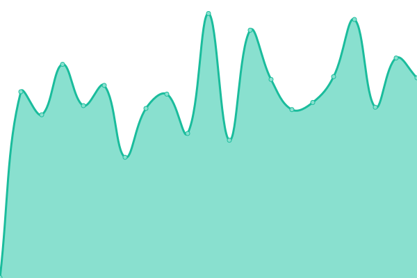
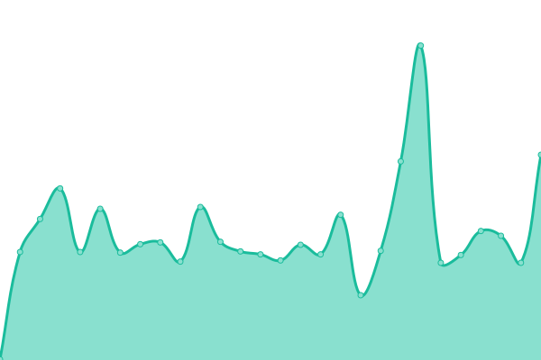
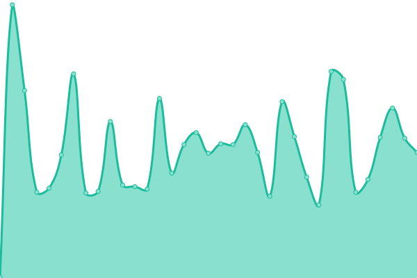
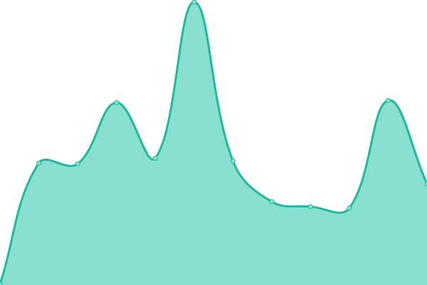

# [📈 Live Status](https://monitor.bullwinkle.ml): <!--live status--> **🟧 Partial outage**

This repository contains the open-source uptime monitor and status page for [Upptime](https://upptime.js.org), powered by [Upptime](https://github.com/upptime/upptime).

With [Upptime](https://upptime.js.org), you can get your own unlimited and free uptime monitor and status page, powered entirely by a GitHub repository. We use [Issues](https://github.com/upptime/upptime/issues) as incident reports, [Actions](https://github.com/upptime/upptime/actions) as uptime monitors, and [Pages](https://monitor.bullwinkle.ml) for the status page.

<!--start: status pages-->
<!-- This summary is generated by Upptime (https://github.com/upptime/upptime) -->
<!-- Do not edit this manually, your changes will be overwritten -->
<!-- prettier-ignore -->
| URL | Status | History | Response Time | Uptime |
| --- | ------ | ------- | ------------- | ------ |
|  [bullwinkle.ml](https://bullwinkle.ml) | 🟩 Up | [bullwinkle-ml.yml](https://github.com/bullwinkle-org/monitor-uptime/commits/HEAD/history/bullwinkle-ml.yml) | 

 463ms
     
 | 

<a href="https://monitor.bullwinkle.ml/history/bullwinkle-ml">100.00%</a>
    

|  [ui.bullwinkle.ml](https://ui.bullwinkle.ml) | 🟩 Up | [ui-bullwinkle-ml.yml](https://github.com/bullwinkle-org/monitor-uptime/commits/HEAD/history/ui-bullwinkle-ml.yml) | 

 220ms
     
 | 

<a href="https://monitor.bullwinkle.ml/history/ui-bullwinkle-ml">100.00%</a>
    

|  [db.bullwinkle.ml](https://db.bullwinkle.ml) | 🟥 Down | [db-bullwinkle-ml.yml](https://github.com/bullwinkle-org/monitor-uptime/commits/HEAD/history/db-bullwinkle-ml.yml) | 

 0ms
     
 | 

<a href="https://monitor.bullwinkle.ml/history/db-bullwinkle-ml">0.00%</a>
    

|  [data.bullwinkle.ml](https://data.bullwinkle.ml) | 🟩 Up | [data-bullwinkle-ml.yml](https://github.com/bullwinkle-org/monitor-uptime/commits/HEAD/history/data-bullwinkle-ml.yml) | 

 250ms
     
 | 

<a href="https://monitor.bullwinkle.ml/history/data-bullwinkle-ml">100.00%</a>
    

|  [static.bullwinkle.ml](https://static.bullwinkle.ml) | 🟩 Up | [static-bullwinkle-ml.yml](https://github.com/bullwinkle-org/monitor-uptime/commits/HEAD/history/static-bullwinkle-ml.yml) | 

 188ms
     
 | 

<a href="https://monitor.bullwinkle.ml/history/static-bullwinkle-ml">100.00%</a>
    

|  [workspace.bullwinkle.ml](https://workspace.bullwinkle.ml) | 🟩 Up | [workspace-bullwinkle-ml.yml](https://github.com/bullwinkle-org/monitor-uptime/commits/HEAD/history/workspace-bullwinkle-ml.yml) | 

 194ms
     
 | 

<a href="https://monitor.bullwinkle.ml/history/workspace-bullwinkle-ml">100.00%</a>
    

|  [realm-app-one.bullwinkle.ml](https://realm-app-one.bullwinkle.ml) | 🟥 Down | [realm-app-one-bullwinkle-ml.yml](https://github.com/bullwinkle-org/monitor-uptime/commits/HEAD/history/realm-app-one-bullwinkle-ml.yml) | 

 0ms
     
 | 

<a href="https://monitor.bullwinkle.ml/history/realm-app-one-bullwinkle-ml">0.00%</a>
    

<!--end: status pages-->

[**Visit our status website →**](https://monitor.bullwinkle.ml)

## 📄 License

- Powered by: [Upptime](https://github.com/upptime/upptime)
- Code: [MIT](./LICENSE) © [Upptime](https://upptime.js.org)
- Data in the `./history` directory: [Open Database License](https://opendatacommons.org/licenses/odbl/1-0/)
- Docs: [Upptime on GitHub](https://upptime.js.org/docs/)
